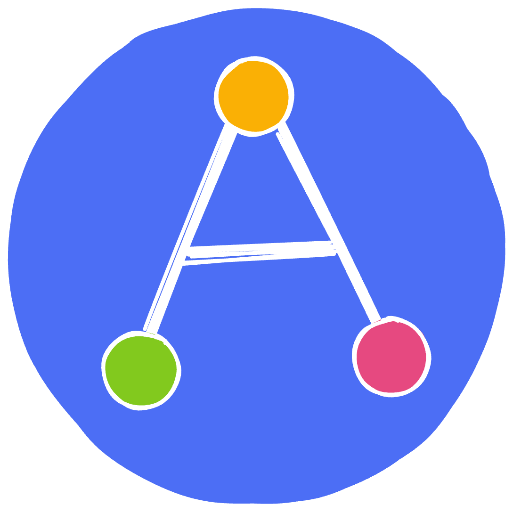
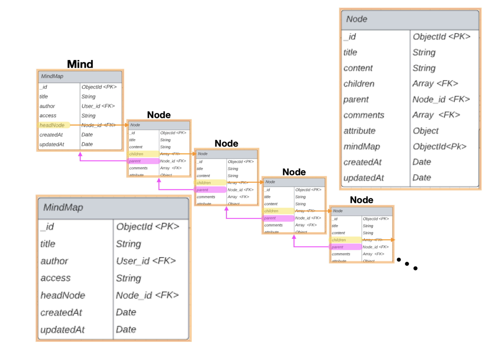
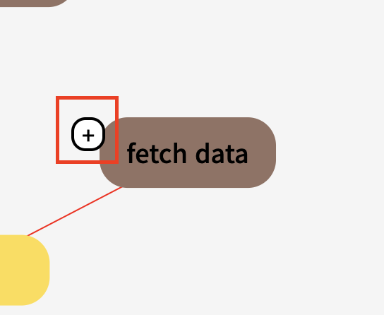
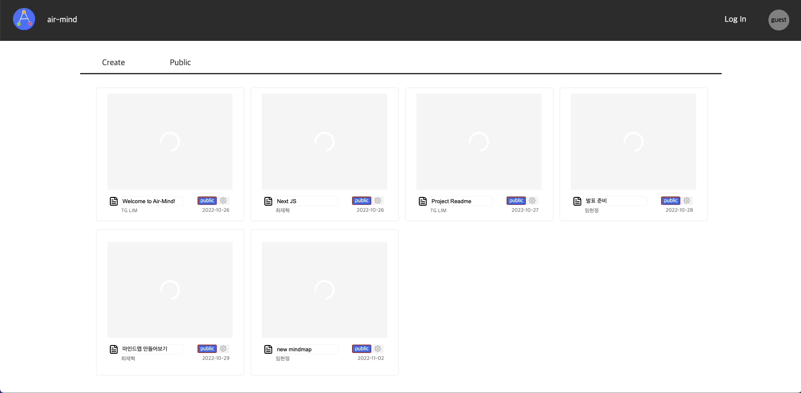
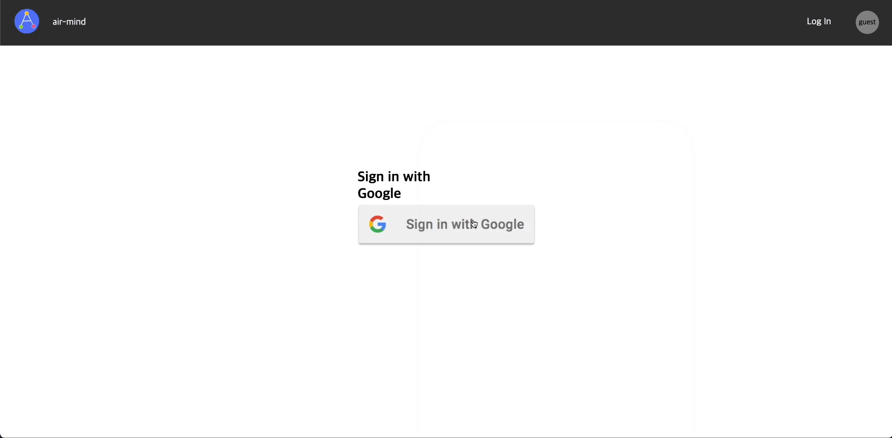
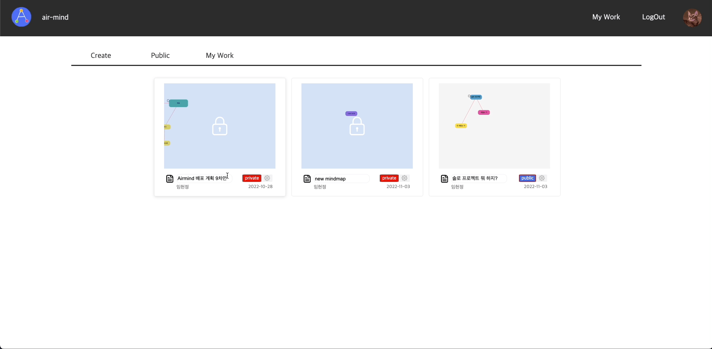
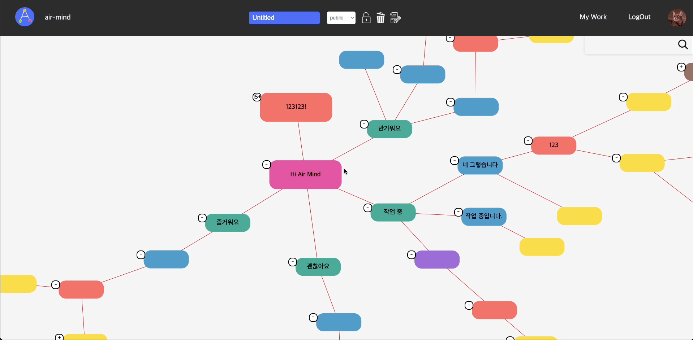

<div>
  
</div>
  
- [Frontend Repository](https://github.com/Team-AOA/air-mind)
- [Backend Repository](https://github.com/Team-AOA/air-mind-server)

# Air Mind

에어 마인드는 아이디어를 쉽게 분류할 수 있는 마인드맵을 만들 수 있는 웹사이트입니다.  
주소를 공유하여 실시간으로 다른 유저들의 작업 상황을 확인하며 소통할 수 있어 아이디어 공유 및 협업이 가능하고, 작업의 생산성을 높일 수 있습니다.


## Table of contents

- [Introduction](https://github.com/Team-AOA/air-mind#air-mind)
- [Motivation](https://github.com/Team-AOA/air-mind#motivation)
- [Build Status](https://github.com/Team-AOA/air-mind#build-status)
- [Schedule](https://github.com/Team-AOA/air-mind#schedule)
- [Tech/Framework used](https://github.com/Team-AOA/air-mind#techframework-used)
- [Code Style](https://github.com/Team-AOA/air-mind#code-style)
- [기술 선정 이유](https://github.com/Team-AOA/air-mind#%EA%B8%B0%EC%88%A0-%EC%84%A0%EC%A0%95-%EC%9D%B4%EC%9C%A0)
- [Challenges](https://github.com/Team-AOA/air-mind#challenges)
- [Installation](https://github.com/Team-AOA/air-mind#installation)
- [Screenshots](https://github.com/Team-AOA/air-mind#screenshots)
- [회고](https://github.com/Team-AOA/air-mind#%ED%9A%8C%EA%B3%A0)
- [Member](https://github.com/Team-AOA/air-mind#member)


## Motivation

처음 시작은 게시글과 태그를 마인드맵으로 연결하는 새로운 타입의 블로그를 만들어보면 어떨까? 라는 생각으로 시작하게 되었습니다. 이 아이디어를 발전시키는 과정에서 한 사람만을 위한 것이 아닌, 많은 유저가 함께 마인드맵을 사용하면서 협업할 수 있으면 더 좋을 것 같다는 생각에 협업 마인드맵을 기획하게 되었습니다. 실시간으로 공유할 수 있다는 의미를 담기 위해 “Air” 라는 이름을 담아 “Air Mind”라는 이름을 지었습니다.

## Build Status

- 클라이언트: Netlify
- 백엔드: Aws Beanstalk  
  (현재 배포 일시 정지 상태입니다. 추후 다시 오픈할 예정입니다.)

## Schedule

#### Idea Brainstorming & Planning

- 2022.10.10 ~ 22.10.17
  - 아이디어 수집 및 기획
  - 구현 가능 여부 사전 조사, 기술 스택 검증, Mockup 작업
  - Agile(애자일) Scrum 프레임 워크 적용

#### Development

- 2022.10.18 ~ 2022.10.28
  - 개발 진행
  - 마무리 (버그 수정 및 배포)

## Tech/Framework used
  <table>
    <tr>
      <th colspan="2">Frontend</th>
      <th colspan="2">Backend</th>
    </tr>
    <tr align="center">
      <td>NextJS</td>
      <td></td>
      <td>Express</td>
      <td></td>
    </tr>
    <tr align="center">
      <td>Recoil</td>
      <td></td>
      <td>Mongoose</td>
      <td></td>
    </tr>
    <tr align="center">
      <td>Styled Compontents</td>
      <td></td>
      <td>Mongoose-autopopulate</td>
      <td></td>
    </tr>
    <tr align="center">
      <td>Socket.io-client</td>
      <td></td>
      <td>Socket.io</td>
      <td></td>
    </tr>
    <tr align="center">
      <td>Firebase Authentication</td>
      <td></td>
      <td>multer</td>
      <td></td>
    </tr>
  </table>

## Code Style

- ES Lint airbnb 룰을 적용했습니다. (`"extends": ["airbnb", "plugin:prettier/recommended"]`) code formatter로는 prettier를 사용했습니다.
  husky pre-commit 기능을 사용하여 커밋 전에 린트 속성에 어긋나지 않는지 검사하는 작업을 추가로 진행하였습니다.
- 컴포넌트 선언 시 함수 선언식을 사용하였고 그 외에는 함수 표현식을 사용했습니다.
- 전반적인 CSS 스타일은 NHN 컨벤션을 적용하였습니다.

## 기술 선정 이유

#### NextJS

마인드맵의 버전을 Public 버전과 Private 버전으로 나누어 Public 버전은 검색에 노출되게 만들기 위해 NextJS를 적용하게 되었습니다. NextJS를 쓰지 않고, React의 helmet을 통해 SEO를 적용하는 방법도 있었지만, 더 SEO에 최적화되어 있고 SSR 방식을 제공하는 NextJS를 통해 새로운 스택에 도전해 보게 되었습니다.

#### Recoil

프로젝트 초기 세팅 시 Redux 사용을 계획했지만 관리해야 하는 데이터양이 많지 않아 보일러 플레이트가 많은 Redux는 저희에게 적합하지 않은 것 같아 선택지에서 제외하게 되었습니다. 그리하여 저희의 상황에 적합한 상태 관리 툴로 Context API와 Recoil이라는 선택지가 생겼습니다. Context API는 렌더링 이슈 문제로 노드의 이동이 많을 수 있는 마인드맵의 경우 적합하지 않을 수 있겠다는 결론에 이르렀고 Recoil이라는 새로운 상태 관리 툴을 사용해 보고자 선택하게 되었습니다.

#### D3

기획 후 가장 최초의 난관이 마인드맵 노드를 생성하고 원하는 대로 움직이게 하는 부분이었습니다. 노드 하나의 구현만이 아니라 노드 모두가 이어져야 할 가능성을 염두에 두어야 하기 때문에 고민이 되는 부분이 많아 가능성을 확인하는 부분에만 시간을 많이 소비하게 되었습니다.

자유롭게 확대하거나 축소하는 설정이 필요한 저희의 프로젝트에는 canvas, svg 중 해상도가 자유로운 svg가 더 적합하단 생각이 들어 svg로 정하게 되었고, 구현하다 보니 값을 설정하는 부분에서 불편함이 많이 생기게 되었습니다.

데이터가 많지 않은 초기 설정에는 괜찮지만, 노드가 수십 개씩 서로를 참조하는 상황이 생겼을 때 핸들링 하기 어려워질 거라 생각을 했고, D3라는 라이브러리를 사용하여 노드를 움직이는 설정 값을 주는 부분, 이벤트를 발생시키는 부분의 복잡도를 해소하고자 하였습니다.

## Challenges

#### Next JS를 쓰면서 생겼던 이슈 해결

Next.js를 사용해 본 팀원은 한 명도 없었고, 별도의 학습시간 없이 필요할 때마다 자료를 찾아가며 바로 적용해야만 했습니다. 초반에는 이해가 부족했기 때문에 에러가 발생할 때마다 SSR로 발생한 에러는 아닌지에 대한 의구심이 반복해서 생겼고 그로 인해 기술구현이 딜레이 되는 경우도 발생했습니다.

hydration error를 발견했을 때는 프리렌더링 된 html 파일과 가상돔 사이에서 비교가 일어나는 환경을 렌더링 된 이후의 트리와 비교가 일어난다고 착각하였습니다.

[https://nextjs.org/docs/messages/react-hydration-error](https://nextjs.org/docs/messages/react-hydration-error)

따라서 useEffect와 useState를 이용하여 간단하게 해결할 수 있음에도 단순 문제 원인 자체를 이해하는 데 시간이 오래 걸렸습니다.

메타태그를 적용할 때는 props를 전달하는 과정에서 props 안의 사용자 데이터가 전부 노출되기 때문에 민감하지 않은 데이터만 따로 추출해서 props로 넘겨 주어야 했고, 동적 경로를 생성할 때는 모든 페이지를 불러오기 위한 API를 추가해야 했습니다. netlify로 Next.js를 배포하기 위해서는 별도 플러그인을 설치해야 했습니다.

돌이켜보면 간단한 코드 몇 줄이면 해결됐음에도 익숙하지 않았기 때문에 해결 방법을 찾는 과정과 적용하는 과정은 전혀 쉽지 않았던 것 같습니다. 한 번도 사용해 보지 않은 새로운 기술을 팀 프로젝트의 적용한다는 것 자체가 challenge이었던 것 같습니다.

#### Node data managing

마인드맵을 구성하는 요소인 Node 데이터를 어떤 구조로 구성하고 관리할지도 저희가 고민한 부분이었습니다. 노드를 부모 노드로부터 자식 노드로 방향성을 가지도록 정의했기 때문에, 노드와 마인드맵의 관계보다 노드와 노드 간의 관계가 더욱 중요하다고 판단되었습니다. 또한, 생각이 계속해서 확장되고 세부사항으로 깊숙이 들어갈 수 있는 것처럼, 마인드맵 또한 무한히 많은 노드들로 확장될 수 있습니다. 마인드맵이 확장되어 가면서 계속 무거워지는 것을 방지하기 위해, 노드와 마인드맵의 관계를 약화시키고 노드와 노드 간의 관계를 중심으로 데이터를 관리하고자 하였습니다. 마인드맵은 가장 head 인 노드의 정보만을 보유하고, 그 이후로는 부모 노드와 자식 노드가 서로의 정보를 보유하는 양방향 일대다 트리 구조는 이러한 목적에 잘 맞았습니다.



**Autopopulate 라이브러리**

이렇게 꼬리를 물며 다른 노드를 참조하는 구조에서 연결된 노드의 정보를 모두 획득하기 위해서는 populate 라는 메소드를 사용해야 합니다. 그런데 노드의 정보는 노드를 생성한 만큼 깊은 단계로 들어가야 볼 수 있으나, mongoose 에서 지원하는 populate 메소드는 사용자가 정확히 지정하는 단계까지만 데이터를 제공합니다. 또한, 깊이가 깊어질수록 어느 단계까지 데이터를 받을지 정확히 지정하기가 어려웠습니다. Mongoose 에서는 기본 populate 메소드만 지원하기 때문에, 외부 라이브러리인 autopopulation 를 통해 문제를 해결하였습니다. autopopulation 은 depth 를 정의하여 원하는 깊이까지의 데이터를 얻을 수 있습니다.

**노드 선택 알고리즘**

마인드맵을 열기 위해 노드의 정보를 불러와 평탄화하는 경우 , 특정 노드와 그 하위의 노드를 모두 삭제하는 경우, 그리고 마인드맵을 삭제하면서 포함된 노드까지 모두 삭제하는 경우에는 모두 해당 노드를 모두 순회하며 노드의 특정 정보만을 한곳에 모으는 작업이 필요합니다. 노드의 데이터 구조를 연결된 리스트와 같은 형태로 구성하면서 감수해야 하게 된 불편한 점이었으나, autopopulation 을 통해 여러 단계의 중첩 데이터를 쉽게 얻을 수 있게 된 덕분에 구현이 용이하였습니다. 중첩데이터로부터 BFS 방식으로 깊이별 노드 데이터를 얻을 수 있습니다.

**노드 데이터 패치**

노드를 노드 간에서만 종속적인 구조로 구성한 것은 노드의 확장성에 긍정적인 영향을 미쳤습니다. 마인드맵의 구조가 복잡해지고 크기가 커지게 될 때, 한번에 모든 노드의 데이터를 전송받고 화면에 띄우기에는 클라이언트와 서버 양쪽 모두 부담스러운 측면이 있습니다. 따라서 한 번에 전송받는 데이터의 양을 노드 수 50개 또는 노드 깊이 5 으로 제한하고, 특정 노드의 하위 노드에 대한 추가 전송 요청이 있을 경우 대응하는 방식을 적용하였습니다.



아직 불러오지 않은 데이터는 노드의 왼쪽 `+` 버튼을 표시하여 fetch 될 데이터가 남아있다는 걸 보여주는 방식을 택했습니다. `+` 버튼을 누르면 추가로 하위 노드의 정보를 가져와 화면에 표시하도록 작업하였습니다.

#### socket i.o

Air-mind 는 일반적인 마인드맵과 달리 실시간 협업이 가능한 서비스로서의 기능을 갖추기 위해 [Socket.io](http://Socket.io) 를 도입하는 것으로 결정하였습니다. Socket.io 의 구현에 가장 신경을 쓴 부분은 전송하는 데이터의 최소화였습니다. 예를 들어 노드의 위치를 변경하는 경우 실시간 좌표 변경은 공유하지 않고 최종적으로 이동한 위치만 공유하였습니다. 또한, 변경되는 데이터를 포함한 모든 데이터를 전송하지 않고, 노드의 위치, 크기, 색상, 타이틀, 내용 등 변경되는 각각의 데이터만 전송하되, 전송 시 사용하는 채널을 구분함으로써 데이터를 받는 쪽에서 어떤 데이터를 변경하는 것인지 알 수 있도록 하였습니다. 한 가지 구현 상 이슈가 발생한 것은 여러 컴포넌트에서 동일한 socket 객체를 공유하는 것이었습니다. 동일한 socket 객체로부터 위치, 크기, 색상 등 모든 정보의 전송을 처리하고 싶은데, 각 컴포넌트가 흩어져 있다 보니 컴포넌트의 prop 으로 객체를 전달하기는 어려웠습니다. 그래서 socket 객체를 recoil를 통해 전역 변수화 하려 보니 해당 객체가 freeze 처리할 수 없다는 문제가 있었습니다. 이에 해당 변수는 freeze 처리하지 않고 사용하도록 recoil atom 선언 시 별도의 옵션을 부여하였습니다.

#### 메인 화면 thumbnail 구현

처음 메인 화면을 구현했을 때엔 `react-webpage-thumbnail`라는 라이브러리를 사용했습니다. 어려울 것이라 생각했던 썸네일 구현이 라이브러리 적용으로 빠르게 끝나자 배운 부분이 없다는 생각이 들어 직접 구현해야겠다는 생각을 했습니다. 어떻게 구현했는지 찾아보니 iframe으로 구현이 되어있었는데, 생각보다 어렵지 않은 방법으로 구현되었다는 걸 알게 되었고, 직접 iframe을 이용하여 구현하게 되었습니다.

iframe에 대해 찾아보니 몇 가지 보안 위험이 따른다는 것을 알게 되었습니다. 그 중 하나인 Cross-Frame Scripting (XFS)과 사용자가 속아서 숨겨진 웹 페이지 요소를 클릭하는 클릭재킹에 대비하여 response 헤더에 X-Frame-Options: 'SAMEORIGIN’을 적용하였고, iframe의 속성인 sandbox를 `"allow-scripts allow-same-origin”`로 적용하였습니다.

iframe으로 구현한 방법은 웹페이지 위에 또 다른 웹을 로드하는 것이라 속도가 느리다는 단점이 있었습니다. 이 단점 때문에 다른 방법을 찾기 위해 canvas의 dataurl을 이용하면 canvas위의 데이터를 이미지로 뽑아낼 수 있다는 걸 알았습니다. 데이터 형식에는 svg, image 형식을 지정할 수 있었는데 저희는 마인드맵 컴포넌트를 올려야 했기 때문에 svg의 foreignObject를 생각했습니다. svg를 이용해 캔버스 위에 올리는 부분을 테스트하는 것 까지는 됐지만, 스타일 적용이 되지 않아 많은 라이브러리를 검색해 보았는데 스크린샷 관련된 라이브러리들 대다수가 html2canvas라는 라이브러리를 쓰고 있다는 걸 알게 되었습니다. 찾아 보니 스타일 적용을 위해서는 돔 트리 + css를 구문 분석하여 적용해주어야 하는 과정이 필요하다는 걸 알게 됐고, 정해진 시간 안에 그 부분을 파악하는 것이 불가능할 것 같아 다시 iframe을 선택하게 되었습니다.

스크린샷을 만든다는 게 쉽지 않다는 걸 느끼게 되었고 프로젝트 시간상 생각했던 방법을 쓰지 못하고 최선의 방법을 선택한 부분에서 매우 아쉬웠습니다. 다음에 시간이 생긴다면 canvas를 이용한 방법으로 다시 적용해보고 싶습니다. 그리고 프로젝트를 진행할 때 라이브러리 없이 혼자서 구현해보는 게 얼마나 중요한 건지 깨닫게 되었습니다.

## Installation

#### Frontend (Next JS)

1. 프로젝트를 다운 받은 후 프로젝트 디렉토리 내부에서 다음 명령어를 입력합니다.

```sh
npm install
```

2. 디렉토리 root 위치에 .env 파일을 생성하여 환경설정을 입력합니다.

```sh
NEXT_PUBLIC_FIREBASE_API_KEY=<YOUR_FIREBASE_API_KEY>
NEXT_PUBLIC_FIREBASE_AUTH_DOMAIN=<YOUR_FIREBASE_AUTH_DOMAIN>
NEXT_PUBLIC_FIREBASE_PROJECT_ID=<YOUR_FIREBASE_PROJECT_ID>
NEXT_PUBLIC_FIREBASE_STORAGE_BUCKET=<YOUR_FIREBASE_STORAGE_BUCKET>
NEXT_PUBLIC_FIREBASE_MESSAGING_SENDER_ID=<YOUR_FIREBASE_MESSAGING_SENDER_ID>
NEXT_PUBLIC_FIREBASE_APP_ID=<YOUR_FIREBASE_APP_ID>

NEXT_PUBLIC_BASE_URL=<YOUR_FIREBASE_BASE_URL>
NEXT_PUBLIC_CLIENT_URL=<YOUR_CLIENT_URL>
```

3.

```sh
npm start
```

#### Backend (Express)

1. 프로젝트를 다운 받은 후 프로젝트 디렉토리 내부에서 다음 명령어를 입력합니다.

```sh
npm install
```

2. 디렉토리 root 위치에 .env 파일을 생성하여 환경설정을 입력합니다.

```sh
MONGO_DB=<YOUR_MONGO_DB_ADDRESS>
CLIENT_URL=<YOUR_CLIENT_URL>

CLOUD_END_POINT=<YOUR_CLOUD_END_POINT>
CLOUD_REGION=<YOUR_CLOUD_REGION>
CLOUD_ACCESS_KEY=<YOUR_CLOUD_ACCESS_KEY>
CLOUD_SECRET_KEY=<YOUR_CLOUD_SECRET_KEY>

FIREBASE_SERVICE_KEY_TYPE=<YOUR_FIREBASE_SERVICE_KEY_TYPE>
FIREBASE_SERVICE_PROJECT_ID=<YOUR_FIREBASE_SERVICE_PROJECT_ID>
FIREBASE_SERVICE_PROJECT_KEY_ID=<YOUR_FIREBASE_SERVICE_PROJECT_KEY_ID>
FIREBASE_SERVICE_PRIVATE_KEY=<YOUR_FIREBASE_SERVICE_PRIVATE_KEY>
FIREBASE_SERVICE_CLIENT_EMAIL=<YOUR_FIREBASE_SERVICE_CLIENT_EMAIL>
FIREBASE_SERVICE_CLIENT_ID=<YOUR_FIREBASE_SERVICE_CLIENT_ID>
FIREBASE_SERVICE_AUTH_URI=<YOUR_FIREBASE_SERVICE_AUTH_URI>
FIREBASE_SERVICE_TOKEN_URI=<YOUR_FIREBASE_SERVICE_TOKEN_URI>
FIREBASE_SERVICE_AUTH_PROVIDER_URL=<YOUR_FIREBASE_SERVICE_AUTH_PROVIDER_URL>
FIREBASE_SERVICE_CLIENT_URL=<YOUR_FIREBASE_SERVICE_CLIENT_URL>
```

- CLOUD : Naver Cloud Object storage S3 관련 변수들 입니다.
- FIREBASE_SERVICE_KEY: firebase server key를 받게 되면 저 부분이 나뉘어 있지 않고 한 파일에 모여 있습니다. aws beanstalk 배포를 했을 때 문제가 생겨 하나의 파일을 분리하게 되었습니다. 한 파일에 있는 부분을 저 양식에 맞게 분리해서 사용해야 합니다.

3.

```sh
npm start
```

## Screenshots

<table>
  <tr align="center">
    <td>Page</td>
    <td>Screenshot</td>
    <td>Features</td>
  </tr>
  <tr>
    <td align="center">
      Main
    </td>
    <td>
      <a href="https://github.com/Team-AOA/air-mind/blob/development/public/readme/1.main.gif" target="_blank">
        
      </a>
    </td>
    <td>
    <ul>
      <li>Public 버전 마인드맵 리스트 확인</li>
      <li>마인드맵 페이지 썸네일 확인 기능</li>
      <li>로그인하지 않으면 Public 버전의 모든 마인드맵 확인 가능</li>
      <li>로그인하지 않으면 마인드맵 수정 불가능, 노드 제목, 내용 등 확인만 가능</li>
      <li>메인에서 본인이 만든 마인드맵이라면 이름 수정, 삭제 가능</li>
    </ul>
    </td>
  </tr>
    <tr>
    <td align="center">Login, Main</td>
    <td>
      <a href="https://github.com/Team-AOA/air-mind/blob/development/public/readme/2.login.gif" target="_blank">
        
      </a>
    </td>
    <td>
    <ul>
      <li>Public 버전 마인드맵 리스트 확인</li>
      <li>Firebase Google 로그인 사용</li>
      <li>로그인 시 My Work 메뉴 추가</li>
      <li>메인에서 본인이 만든 마인드맵이라면 이름 수정, 삭제 가능</li>
    </ul>
    </td>
  </tr>
  <tr>
    <td align="center">
      My Work
    </td>
    <td>
      <a href="https://github.com/Team-AOA/air-mind/blob/development/public/readme/3.mywork.gif" target="_blank">
        
      </a>
    </td>
    <td>
    <ul>
      <li>유저 본인이 만든 전체 마인드맵 리스트 확인</li>
      <li>시간순으로 정렬</li>
      <li>Private 버전, Public 버전 모두 확인 가능</li>
      <li>마인드맵 이름 수정, 삭제 가능</li>
    </ul>
    </td>
  </tr>
  <tr>
    <td align="center">
      Mind-map</br>
      (Node Menu)
    </td>
    <td>
      <a href="https://github.com/Team-AOA/air-mind/blob/development/public/readme/4.node-menu.gif" target="_blank">
        
      </a>
    </td>
    <td>
    <ul>
      <li>노드 타이틀, 내용 입력 기능, 사진 추가(드래그 또는 선택) 기능, 사진 삭제 기능</li>
    </ul>
    </td>
  </tr>
  <tr>
    <td align="center">
      Mind-map</br>
      (Node Hover Option)
    </td>
    <td>
      <a href="https://github.com/Team-AOA/air-mind/blob/development/public/readme/5.node-hover.gif" target="_blank">
        
      </a>
    </td>
    <td>
    <ul>
      <li>다른 유저의 노드(마인드맵을 이루는 박스) 색상 변경, 사이즈 변경, 노드 추가, 노드 삭제 모두 실시간으로 확인 가능</li>
      <li>자식 노드 안 보이게 fold 하는 기능</li>
    </ul>
    </td>
  </tr>
  <tr>
    <td align="center">
      Mind-map</br>
      (Real time Collaboration)
    </td>
    <td>
      <a href="https://github.com/Team-AOA/air-mind/blob/development/public/readme/6.socket.gif" target="_blank">
        
      </a>
    </td>
    <td>
    <ul>
      <li>유저가 위치하고 있는 노드에 유저 아이콘 표시</li>
      <li>방해받기 금지 모드를 통해 다른 유저 노드 fold 이벤트 적용되지 않는 기능</li>
      <li>댓글 기능을 이용하여 실시간 채팅 기능</li>
    </ul>
    </td>
  </tr>
</table>

## 회고

#### 임태근

부트캠프 기간 동안 과제나 시험을 치르면서 몇 가지 서비스를 만들어 보았지만, 이번 팀 프로젝트에서 만든 서비스만큼의 완성도를 지닌 것은 없었습니다. 투입한 시간도 차이가 있지만, 무엇보다 차이가 큰 것은 여러 사람이 서로의 관심사와 중요도를 서로 소통하며 어떤 기능을 우선으로 구현할지 지속적인 논의를 했다는 점이라고 생각하며, 또한 각자가 잘할 수 있는 부분을 우선으로 구현하였기에 두루 빠짐이 없이 일정 수준 이상의 완성도를 가졌다는 것도 중요한 것 같습니다. 마지막으로 무엇보다도 중요한 것은, 팀원들과 제가 서로 보완적으로 서로의 빈틈을 메꿔주었다는 것입니다. 제가 어떤 에러에 맞닥뜨려 진행이 되지 않을 때 팀원들이 검색해서 알려주거나 기존에 알고 있던 것을 저에게 알려주어 쉽게 해결하였고, 조금 지치고 확신이 없을 때 다른 팀원이 힘차게 구현해 나가는 것에서 다시 기분을 전환하고 힘을 얻을 수 있었던 경험이 쌓이면서 확신하게 되었습니다.

프로젝트 초 중기, 서로 생각하는 바가 일치하지 않고 지향하는 목표가 달라, 논의를 계속하면서도 완전히 만족스럽거나 즐겁지만은 않았습니다. 논의도 결정도 더뎌지면서 여러 사람이 모여도 효율적으로 일하기는 어렵겠다고 생각했지만, 서로 얼마간 양보하면서 명확한 목표를 정한 이후로는 오히려 속도도 빨라지고 서로 의지하며 시너지를 내는 관계가 될 수 있었던 것 같습니다. 완전히 동등한 관계를 유지하며 동일한 목표와 의지를 가지고 프로젝트를 함께 수행할 수 있는 이런 얼마 안 되는 기회를 가지게 되어 즐거웠습니다.

#### 최재혁

제 부족한 점을 더 확실하게 알게 되었던 시간이었습니다.

팀원 들로부터 기술적인 부분, 에러를 대처하는 방법 등 정말 많은 것을 배웠지만 가장 크게 느꼈던 점은 업무에 대한 꼼꼼함과 태도였습니다. 어떤 코드를 작성할 때 이후에 작성하게 될 코드까지 생각하며 작업하는 팀원의 모습을 처음 봤을 때는 의아함을 느꼈습니다. 하지만 작업이 진행될수록 해당 코드들이 확장성을 갖춰서 오히려 작업시간이 줄었고 통일성 또한 가지게 되는 모습을 직접 경험했습니다.

어떤 사소한 부분이라도 결코 지나치지 않고 기록하고 본인의 업무뿐만 아니라 다른 팀원의 업무 현황도 지속적으로 체크하고 도움을 주려는 팀원들의 모습에서 따뜻함을 느낀 동시에 제 업무에만 빠져있던 저 자신에게 부끄러움을 느꼈습니다.

이번 팀 프로젝트에서 가장 큰 수확은 저에게 부족한 그들의 장점이 얼마나 유용하고 중요한지에 대해서 직접 피부로 느낄 수 있던 점이라고 생각합니다. 앞으로 어떤 일을 하더라도 두 분의 모습을 잊지 않고 닮으려고 노력하여 더 나은 사람이 되도록 해야겠다는 생각을 가지게 된 좋은 시간이었습니다.

#### 임현정

팀프로젝트에서 제일 중요한 건 커뮤니케이션이라는 걸 배우게 되는 시간이었습니다. 코드를 작성해도 이 코드를 이어받아 다른 팀원이 작성할 수도 있기에 빠른 시간 안에 이해할 수 있는 코드를 작성해야 하고 그 코드를 설명할 줄 알아야 했습니다. 그 과정에서 저에게 부족한 부분이 무엇인지, 어떤 부분을 채워야 하는지 깨닫게 되었습니다.
혼자서 코드를 작성할 때는 혼자만 이해하고 넘어갔던 부분을 이제는 "왜?" 라는 생각을 늘 하게 되었습니다.

첫 팀프로젝트에 임하기 전의 마음가짐과 지금의 마음가짐을 비교해봤을 때 한층 더 성장한 것 같습니다. 시작하기 전엔 혼자서 많은 부분을 내가 해내야 한다는 생각이 많았지만, 끝난 지금으로서는 혼자 해내야 하는 게 아닌 팀원 모두가 함께 헤쳐나간다는 생각으로 바뀌게 되었습니다. 그만큼 저희 팀원에게 배운 점도 많고 팀워크라는 것이 무엇인지 배우게 되는 값진 시간이었습니다.

## Member

- [임태근](https://github.com/dkqp)
  Contact: ltg0513@gmail.com

- [최재혁](https://github.com/Sharpen-Cjh)
  Contact: jaehyeok92007@gmail.com

- [임현정](https://github.com/h-alex2)
  Contact: glowhyun1@gmail.com
